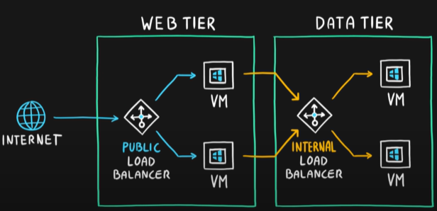

# Project README

## Author
- **Name:** Utsav Chaudhary
- **Name:** UttU28
- **Email:** [utsavmaan28@gmail.com](mailto:utsavmaan28@gmail.com)


https://learn.microsoft.com/en-us/azure/well-architected/service-guides/?product=popular

https://readme.so/editor

# **AZURE CORE ARCHITECTURE COMPONENTS**
-   ## **Physical Infrastructure** :
    
    ```
    Data Center ---> Availability Zone ---> Region ---> Geography
    ```
    
    -   Use Availability Zones to protect from **FAILURE**
    -   Increase availability by **CO-LOCATING** ```Compute, Network, Storage, Data ``` within the *Availability Zones* and **REPLICATING** it in other *Availability Zones*
    -   A **Data Center** is a ***Physical Facility*** housing computing infrastructure, located within an **Availability Zone (AZ)** within a **Region**, which in turn belongs to a specific **Geographic Location**.

    ### Services that **Supports** Availability Zones are:
    -   **Zonal Services**: Pin resources to **Specific Zone**
        ```VM, Managed Disk, IP Addr```

    -   **Zone Redundant Services**:    The platform **Replicates Automatically** according to the Zones.
        ```Zone Redundant Storage, SQL Database```

    -   **Non Regional Services**:  Set in other **Geographies**, you'll face **HIGH Latency** but ***USEFUL***
    -   **WHAT IF?**: ```Large event impacts multiple AZone in a Region??``` **--->** ***REGION PAIRS***

-   ## **Management Infrastructure**
    -   **Resources and Resource Groups**:
        -   Anything you **Create, Provision, Deploy** is a Resource.
    -   **Subscriptions**:
        -   Allows you to organize your **Resource Groups**.
        -   **Single Subscription**:
            -   Single Billing Mode, Single Access Managememnt Policy
        -   **Multiple Subscription**:
            -   Multiple Billing Mode, Multiple Access Managememnt Policy
    -   **Managememnt Groups**:
        -   Manages Everything.
        -   **Rules applied to MGroup** is applied to all the **Resources / Resource Groups**.
    -   Use **RBAC** - ***Rule Based Access Control*** for assigining **PERMISSIONS**

# **Computing Options**

## **Virtualization**
-   All applications on same OS share all the same resources and may have conflicts of data or ports or anyhting.
-   To overcome that we user **Virtualization**, it helps us have individual OS for each application.  
## **Virtual Machines (VMs)**
-   Provides **Infrasructure as a Code (IaaC)**
-   VM Needs **Configuration, Updation and Management**.
-   Group of VMs can be Managed using:
    -   **VM Scale Set (VMSS)**:
        -   Automate, Manage, Configure & Update multiple VM.
        -   Automatically applies Load Balancer.
        -   Scaling Scheduler for Horizontal Scaling and Dynamic Workload.
        -   Suited for **STATELESS**

    -   **VM Availability Set**:
        -   Ensures **High Availability** and **Fault Tolerance** by distributing VM instances across fault and update domains within an Azure data center.
        -   Uses Fault Domain (Same Data Center but different RIGS) and Update Domain (Group of Domains that needs to be updated together)
        -   Suited for **STATEFUL**

-   ### **Azure VM Image Builder**
    -   Automate the ***Creation, Customization and Distribution of VM***.
    -   Can use the image in ***Azure*** and other ***Cloud Platforms***
    -   Can use the image for ***VM, VMSS, Other Cloud Services***
    -   Allows ***Customization and Control*** over ***OS, VM, Environments***.
    -   Integrate with ***Azure DevOps*** and other ***CI / CD pipeline***

-   ### **Azure Dedicated Hosts**
    -   Provides Dedicated Host for your Organization.
    -   Hardware of **Your CHOICE**
    -   Doesnt share **Hardware resources**.
    -   ***Isolation*** at **Physical Level**
    -   Service Supported by: ***Virtual Machines, Azure Virtual Machine Scale Set, Azure Kuberneted Service, Azure App Service***

-   ### **Azure Spot Virtual Machines**
    -   Access to unused ***Azure Compute Capacity***.
    -   Good for **Batch Processing, Dev/Test Environments**.
    -   **Interruption** with **30s Timer**.
    -   Service Supported by: ***Virtual Machines, Batch, Kubernetes, Functions, VMSS***

-   ### **SQL Server on Azure Virtual Machines (VMs)**
    -   It's a SQL server hosted on a Virtual Machine
    -   Provides more **flexibility and control** but requires users to **manage infrastructure**.

## **Containers**
-   Lightweight alternative of VM if you dont want anything to do with OS.
-   Run **Multiple Containers** on a single instance of **Physical / Virtual Host**
-   Multiple instances of an application on a single host machine.
-   **No Management of OS** is required. ***SANDBOX*** Environment
-   Quick **Restart** on **FAILURE**
-   **Container Services**:
    -   ### **Container Group**:
        -   **Collection of containers** that get scheduled on the **same host machine**.
        -   The **Containers** in a **Container Group** share a **lifecycle, resources, local network, and storage volume**s.
    -   ### **Azure Container Instances**:
        -   Simplest and Fastest way to run a **Container**.
        -   Ideal for **Batch Processing, Dev/Test environments, or running Microservices** that don't require orchestration.
        -   **PaaS** Service
    -   ### **Azure Container Apps**:
        -   Similar to **Azure Container Instances** but offers more **Control, Scalability and Management**
        -   **BUILT IN**:
            -   **Load Balancing** & **Scaling**
            -   Managing Lifeycle of Containerised Apps
            -   Deployment
            -   Monitoring
            -   CI / CD Pipeline
    -   ### **Azure Kubernetes Services**:
        -   It is used for **Orchestrating Containerised Application** including:
            -   Automatic Scaling
            -   Rolling Updates
            -   Load Balancing
        -   Offers more **Control and Flexibility** compared to above, but requires more **MANAGEMENT**
        -   Suitable for complex applications with high availability, scalability, and production-grade requirements.

## **Azure Functions**:
-   Infrastructure is just **MUAHHHHH**, ready for Everything.
-   **Hard timeout** keep that in mind.
-   Just focus on the code and everything rest is taken care by the Functions
-   Functions **Scale automatically** based on demand
-   **Event Driven** can be triggered by various events like **HTTP requests, Database changes, Service Bus Messages**, many more.
-   **Integrated Security** with ***Azure Active Directory*** for **Authentication** and **Authorization**

## **Azure Batch Service**
-   It's a Cloud-Scale **Job Scheduling and Compute Management** service in Azure that enables you to run **large-scale parallel and high-performance computing (HPC)** workloads efficiently.
-   **Key Features**:
    -   **Automatic Scaling**
    -   **Task Prioritization & Resource Allocation**
    -   **Job Scheduling**
    -   **Task Parallelism** is breaking down a large batch jobs into smaller jobs and run them parallelly.

## **Azure App Service**
-   Allows Management, Deploying and Developing of Web Apps and APIs.
-   Enables automated deployments from GitHub, Azure DevOps, or any Git repo for **CI / CD**
-   Supports framework such as Python, Java, NodeJS, ASP.NET
-   Provides **BUILT-IN** support for **Scaling, Load Balancing and High Availability**
-   Types:
    -   Web Apps
    -   API Apps
    -   WebJobs
    -   Mobile Apps

## **Azure Logic Apps**
-   Automate Workflows and Integrate Applications, Data and Services ***WITHOUT CODE***.
-   Many **CONNECTORS** are available for Azure Services and APIs.
-   **TRIGGERS** are events that start logic apps, can be ***HTTP, Email, Message, File Change***
-   Provides **Montoring and Analytics** service.


# **AZURE NETWORKING OPTIONS**

## **Virtual Network (VNet)**

-   Fundamental Building block fo Connecting Resources and Services to Internet or with each other
-   **SUBNET** is smaller Virtual Network, can implement **ISOLATION**. IP Allocation in a good manner, grouping and securoty to it.
-   All resources have **OUTBOUND** connection by Default. Can use **Public IP, NAT Gateway, Public Load Balancers** for managing traffic.
-   **INBOUND** connections can be made by assigning **Public IP or Public Load Balancer**.
-   **VNet PEERING & VPN Gateways** allows us to connect multiple VNets to each other. *(Merging 2 or more Villages, to make an interconnected TOWN)*
-   Connect **ON-PREMISE Computers & Networks** to VNet by using:
    -   **Point-to-Site VPN** : VNet and a single Computer, each Computer must configure it's connections.
    -   **Site-to-Site VPN** : On-Premise VPN and Azure VPN
    -   **Azure Express Routes** : Secure Private Connection of On-Premise N/W to Azure Cloud Services.
-   Filter **NETWORK TRAFFIC**
    -   **Network Security Groups** : Contains Inbound and Outbound traffic rules. Enables filters on IP Addr, Port and Protocol 
    -   **Network Virtual Appliances** : It's a software that acts as hardware and can do **Firewall, Routing, Load Balancing, Intrusion Detection / Prevention System**.
-   Route **NETWORK TRAFFIC**
    -   **Route Tables** : Write custom ruls of how traffic should be Directed. Create table for how the packets are to be routed b/w subnets.
    -   **Border Gateway Protocol (BGP)** : Routing protocol used to exchange routing information between different networks on the internet. Finds best path for data to travel.

## **Virtual Private Newteork VPN**
-   A virtual private network (VPN) uses an encrypted tunnel within another network. VPNs are typically deployed to connect two or more trusted private networks to one another over an untrusted network. Traffic is encrypted while traveling over the untrusted network to prevent eavesdropping or other attacks.
-   **Azure VPN Gateway** is a network device or service that acts as an endpoint for VPN connections. (Connects On-Premise Netwk Infra with the Badal (Cloud) Netwk Infra)
-   **Azure VPN Gateway** Instances are deployed in a dedicated subnet of the virtual network and enable the following connectivity:
    -   Point-to-Site
    -   Site-to-Site
    -   Network-to-Network
-   Types of **VPN Gateways**:
    -   **Policy-Based Gateways**:
        -   Forwarding data is based on the defined policy.
        -   Based on these policies, the VPN gateway decides whether to allow, deny, or route packets accordingly.
    -   **Route-Based Gateways**:
        -   Forwarding data is based on the Routing Tables.
        -   BGP, OSPF and Static routes are used to make these Routing Tables.
        -   Dynamic Routing and Scalability
        ---
        -   Connections between virtual networks
        -   Point-to-site connections
        -   Multisite connections
        -   Coexistence with an Azure ExpressRoute gateway
-   High Availability Scenarios
    -   **Active / Standby**
        -   VPN Gateway Resource: 1 Active and 1 Standby
        -   Failover time: Few Seconds for Planned, 90s for Unplanned
    -   **Active / Active**
        -   Both are active and shares the load.
        -   One down, another one ready to take/share the load.
    -   **Zone Redundant Gateways**
        -   The gateways are shared accros all the availability zones and provide fail over to them (duhhhh)

## **Traffic Distribution in Azure**
-   How to achieve Scalability and High-Availability accross Same / Different Regions????? Kaun bachayega hame??? Hai koi Shoor Veer??
-   2 hai Bhai:
    -   ### **Azure Load Balancer**
        
        -   Distribution of Traffic accross Same Multiple Resources :lol:
        -   Scaling Out
        -   Supports ***TCP & UDP*** applications
        *   **PUBLIC LOAD BALANCER** (Sab ka Legi) (For public to access)
        *   **INTERNAL LOAD BALANCER** (Resources ka Legi) (For resources to access internally, not for PUBLIC)
    -   ### **Azure Application Gateway**
        
        -   Use for WEB based traffic (HTTP/S)
        -   SSL Termination (DECRYPTS  ` HTTPS --> HTTP ` for easy and fast request response)

    - ONE MORE BONUS FROM MY SIDE
    -   ### **Azure Content Delivery Network (CDN)**
        -   All the static pages needs to be sent everytime a user makes a Request.
        -   So, use **CDN** to have its presence in different locations for people to access it with ***Minimum Latnecy***. 
        -   Over 120 locations are present. 

# **Azure Storage Services**


# **Azure Storage Redundancy**
-   **LRS (Locally Redundant Storage)**:
    -   **Data Replication** 3 times within **same Data Center**
-   **ZRS(Zone-redundant Storage)** :
    -   Data is **replicated synchronously** across multiple **Availability Zones** within the **same region**.
-   **GRS(Geo-redundant Storage)** :
    -   Data is **replicated asynchronously** to a **secondary region** located hundreds of miles away from the **primary region**.
    -   During a **regional outage or failover**, data access is **not available** in the secondary region until **failover completes**.
-   **GZRS(Geo-zone-redundant Storage)** :
    -   Data is **replicated** accross multiple **AZones** and **asynchronously** to **Secondary Storage**
-   **RA-GRS(Read-access Geo-redundant Storage)** :
    -   Similar to GRS but provides **read access** to data in the **secondary region** even in the case of a **primary region outage**.
-   **RA-GZRS(Read-access Geo-zone-redundant Storage)** :  
    -   Provides read access to data in both the **secondary region** and across **multiple Availability Zones** within the **Primary region**.

# Definitions

### **Availability Zones**
-   Physically seperated **1 or More Data Centers**.
-   If 1 goes down, another one continues.
-   Connected by **Fiber Optics**.

### **Regions**
-   Atleast **1 or Many** Data Centers in an **AZone**
-   Nearby or Same area
-   **Low Latency** Connection b/w them

### **Region Pairs**
-   **What If**: ```Large event impacts multiple AZone in a Region?? ``` ---> **REGION PAIRS**
-   300 Miles Away
-   Allows **Replication of Resources** across Geographies.
-   Serves automatically to **Fail Overs** to other region in the **Piar**
-   Eg.:
    ``` West US <---> East US ```
    ``` South East Asia <---> East Asia ```
-   **ADVANTAGES**:
    -   During Extensive Outage, it's **Priority** to make sure if **1 is restored quickly**.
    -   Planned Updates **1 at a Time**.
    -   Data is **LAWFULLY** safe in 1 **Geography**


### **Resource**:
-   Anything you **Create, Provision, Deploy** is a Resource.
-   Grouping of multiple **Resources** is called **Resource Groups**
-   ```1 Group --> Many Resources```
-   ```1 Resource --> 1 Group```
-   **NO** nesting of Groups.

### **Resource Groups**
-   Group of Resources.
-   No need to thank me!
