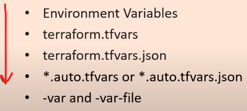

# Project README

## Author

- **Name:** Utsav Chaudhary
- **Name:** UttU28
- **Email:** [utsavmaan28@gmail.com](mailto:utsavmaan28@gmail.com)

# **TERRAFORM**

Recipe for deploying **Infrastructure as Code**

1. Create a **RESOURCE GROUP**
2. Create a **VIRTUAL NETWORK**
3. Create a **PUBLIC IP ADDR**
4. Create a **NETWORK INTERFACE** with _PUBLIC IP_
5. Create a **VIRTUAL MACHINE** with _NETWORK INTERFACE_

## **Terrafrom 002 VS Terraform 003**

- Instead of **null_resource** use **terraform_data**
- **Terraform Taint** has been replaced by `-replace` flag for **Terraform Plan**
- **Terraform Refresh** has been replaced by `-refresh-only` flag for **Terraform Plan**
- Connecting to Terraform Cloud uses **Cloud Bloack** instead of **Remote Block**.
- **_Terraform.lock.hcl_** files are new

# **Infrastructure as Code (IaC)**

- Write down what you wanna deploy instead of clicking it. **_AUTOMATION BAYYYY_**
- Write a **Configuration** script to **_AUTOMATE_** **Creating, Updating or Destroying** cloud infrastructure.
- Codification makes tracking everything easy. Version Control, Collaboration is possible.
- Less human intervention means less errors.

# **IaC TOOLS**

- **IaC Tools Types**:
  - **Declarative**:
    - Define the desired end state of your infrastructure, and the IaC tool figures out how to achieve that state.
    - Declarative IaC tools tend to be idempotent
    - `Terraform, Azure Resource Manager (ARM), AWS CloudFormation, Google Cloud Deployment Manager`
  - **Imperative**:
    - Specify the exact steps or commands needed to achieve the desired infrastructure state.
    - May require additional logic to handle idempotency.
    - `Ansible, Chef, Puppet`

# **Configuration Drift**

- When **Infrastructure** has unexpected configuration change.
- Detection:
  - Compliance Tools (AWS Config, Azure Policies)
  - Save the expected **STATE** in the State File using Terraform.
- Correction:
  - Compliance Tools (AWS Config, Azure Policies)
  - Terraform **Refresh** and **Plan** command.
  - Manually _(Dont do it)_
- Prevention:
  - Immutable Infrastructure | Always create and Destroy, dont resue.
  - Backup the Infrastructure Image

# **Mutable VS Immutable Infrastructure**

- Mutable: `DEVELOP  -->  DEPLOY  -->  CONFIGURE` (Ansible, Chef, Puppet)
- Immutable: `DEVELOP  -->  CONFIGURE  -->  DEPLOY` (Terraform)

# **Why TERRAFORM?**

- Open-Source and Coud-Agnostic **Infrastructure as Code (IaC)** tool.
- Uses **Declarative** _CONFIG_ files
- Supports a vast array of **Public** and **Private** cloud vendors.
- Tracks **State** of each resource deployed.

# **Why TERRAFORM CLOUD?**

- **Software as a Service (SaaS)** tool.
- Version Control, Flexible Workflows
- Team Collaboration.

# **INSTALL TERRAFORM**

1. Download Manually and add the file to **PATH**
2. Setup Terraform Repo on Linux, Use package maanger to install it. For **LINUX ONLY**

```
sudo yum install -y yum-utils
sudo yum-config-manager --add-repo https://rpm.releases.hashicorp.com/RHEL/hashicorp.repo
sudo yum -y install terraform
```

# **TERRAFORM WORKFLOW**


Terraform uses **CHANGE AUTOMATION** to apply and review complex **Changesets**.

`WRITE ---> PLAN ---> APPLY`

---

# **TERRAFORM KEY CONCEPTS**

## **_PLAN_** **|** **_APPLY_** **|** **_DESTROY_**

---

## **Terraform GRAPH**

- Creates a Dependency Graph based on declared **Dependencies** and **Determines** the order in which the resources needs to be processed.
- **Parallelism** can be achieved by Grouping the Independent Resources together and processing it **concurrently**.
  :
- **STEPS**
  - Resource Declarations
  - Dependencies
  - Graph Construction
  - Execution Order
  - Parallelism

## **TERRAFORM INIT**

- Initializing the working directory.
- Downloads supporting or ancillary code (Providers), modules and plugins.
- Sets **BACKEND** for **_Terraform State File_**

## **Terraform PLAN**

- Reads the code and creates a **PLAN** of EXECUTION / DEPLOYMENT.
- Doesn't deploy anything. Justr a **READ-ONLY** command.
- Allows review of action plan before executing anything.
- Authentication Credentials are used to connect your Infrastructure, **_IF REQUIRED_**

## **Terraform APPLY**

- Deploys the code.
- It tracks all the resources and then stores the data inside the **STATE FILE** _(STate Tracking Mechanism File)_

## **Terraform DESTROY**

- **USE WITH _! i !_ CAUTION _! i !_ , NON REVERSIBLE**
- Looks at the records from the **STATE FILE** and deletes everything.

# **Terraform PROVIDERS**

- Terraform List of all Providers: `terraform providers`
- Providers are usually found in **TERRAFORM PROVIDER REGISTERY** **_(PUBLIC)_**
- Providers are plugins that enable the management of resources in a specific cloud or infrastructure platform.
- Providers serve as the bridge between Terraform and the API of the underlying platform, allowing Terraform to create, update, and delete resources in a consistent and reproducible manner.
- Aukaat hai to khud ka likh le... (**AUKAAT** is important)
- Always mention the VERSION you wanna use.

```
provider "aws" {
    version = "L.0.L"
    region = "us-west-2"
}
```

# **Terraform STATE**

- It is a **JSON** file containing all the metadata of all the resources deployed. The file name is **TERRAFORM.TFSTATE**
- It is a map file of **Terraform Configuration** and **Managed Infrastructure**
- Prior to any **Modification** operation, Terraform refreshes the state file.
- Resource dependency metadata is also tracked via the State File.
- Kuch bhe Khona, par ye file mat khona mere dost.

* Manually remove resources form the state file so its not managed by Terraform anymore.
* List out tracked resources and their details.

```
  terraform state list                                    # List out all resources tracked by Terraform State file.
  terraform state rm sometingFromTheListAbove             # Delete a Resource from Terraform State fiel.
  terraform state show sometingFromTheListAbove           # Show details of a resource tracked in the Sttae file.
```

# **Terraform DEBUGGING**

- Valid values for **TF_LOG** are **_TRACE, DEBUG, INFO, WARN, and ERROR_**.
- The **TF_LOG** environment variable controls the verbosity of the Terraform command-line output.
  - `TF_LOG=DEBUG terraform apply`
- The **TF_LOG_PATH** environment variable allows you to specify a file where the logs will be written.
  - `TF_LOG=DEBUG TF_LOG_PATH=terraform.log terraform apply`

# **Terraform FORMAT**

- Formats code for readability.
- Helps in keeping code, consistant.
- Safe to run at anytime

`  terraform fmt`

# **Terraform TAINT**

- Forces a resource to be **DESTROYED** and **RECREATED**
- Modifies the **State File**, other Resources might be affected by it.
- Replace **Misbehaving Resources _FORCEFULLY_**
- Once marked Tainted, it'll destroy and recreate in next `terraform apply` command.

`  terraform taint resourceAddress
  terraform taint aws_instance.my_instance`

# **Terraform IMPORT**

- Used to import existing infrastructure into Terraform's state.
- Useful when you have resources that were created outside of Terraform, and you want to start managing them using Terraform.

`  terraform import [OPTIONS] ADDR ID
  terraform import aws_instance.my_instance i-0c1234567890abcdef`

# **Terraform WORKSPACES**

- Workspaces are alternate **STATE FILES** within the same working directory.
- It starts with a single workspace that is **_DEFAULT_** and cannot be deleted.
- Terraform workspaces allow you to manage multiple instances of your infrastructure in a single Terraform configuration.
- Each workspace has its own state file, allowing you to maintain separate sets of resources for development, testing, staging, and production environments.
- USES:
  - **Environment Isolation**: Can have seperate workspace for Testing, Staging, Production and Development
  - **Parallel Deployment**: Enable you to deploy multiple instances of your infrastructure simultaneously without interference.
  - **Configuration Overrides**: You can override specific variables or resources for different workspaces.

`  terraform workspace new workspaceName               # Creation
  terraform workspace select workspaceName            # Selection`

`

# main.tf

provider "aws" {
region = var.aws_region
}

resource "aws_instance" "example" {
ami = "ami-0c55b159cbfafe1f0"
instance_type = "t2.micro"
}

terraform workspace new dev
terraform workspace new prod

terraform workspace select dev
terraform apply -var 'aws_region=us-west-2'

terraform workspace select prod
terraform apply -var 'aws_region=us-east-1'
`

# **Terraform PROVISIONERS**

- Provisioners are used to perform additional tasks on a resource after it's created or destroyed.
- Typically used to configure or set up software on instances, perform post-deployment tasks, or execute custom scripts.
- Types of **Provisioner**:
  - Local-exec Provisioner
  - Remote-exec Provisioner
  - File Provisioner
  - Ansible Provisioner
  - Chef Provisioner

# **Terraform STATE Storage**

- LOCALLY

  - Saves State Locally by Default.
  - Only for you :) <3

- REMOTE

  - Saves in Remote (AWS S3, Google Storage, et...c)
  - Sab ko help karega tera bhai, its shared between teams so anyone can see and write depending on the permissions.

- **_STate Locking_**: Once you do `terraform apply` then the state is automatically locked, so no **parallel/multiple/redundant** executuion. (Default in Local)
- Enables Sharing of **OUTPUT** values with other Terraform Configurtion or Code. (After Successful creation of the Resources, my team can access the IP and other details of the Resource, for furhter use)

# **Terraform MODULES**

- Module is a **Container** for multiple resources that are used together.
- Every configuration has one module called **ROOT**, which consists of code files in main Directory.
- Can be downloaded or referenced from
  - **Terraform Public Registry**
  - **A Private Registery**
  - **Local System**
- Modules can take **INPUT** and provide **OUTPUTS** to plug back into the main code.

```
    module "myModuleName" {
        source = "./modules/vpc"
        version = "0.0.5"
        region = var.region             # Input Parametters for the Modules.
    }
```

# Other Allowed Parameters: count, for_each, providers, depends_on

# **Built-In Functions**

- Terraform has **Built-In**, **Pre Defined** functions.
- No **USER-DEFINED** functinos are allowed.

# DATA SOURCES**
-   Allows to use Information defined **outside of** the Terraform, by **another** Terraform or **Modified by a Function**.

# **VARIABLES**
- TYPES:

    - **Input Variables**
    ```
        variable "region" {
            description = "The AWS region where resources will be provisioned."
            type        = string
        }
    ```

    - **Output Variables**
        - Used for printing the Output of the variable values on the shell after running **_terraform apply_**
        - These can be also called **Return Values**
        - `terraform output` will print all the output data present in the state file
        ```
            output "instanceIP" {
                description = "Current Private IP of the VM"
                value = aws_instance.vmName.private_ip
            }
        ```

    - **Local Variables**
        -   Inititalized and used within the same file.
        -   Can have more than 1 **LOCALS** in a file

        ```
            locals {
                instance_name = "web-server"
                instance_type = "t2.micro"
            }
        ```

    - **Module Variables**

        ```
            module "example" {
                source = "./example-module"

                instance_count = 3
                instance_type  = "t2.micro"
            }

        ```

    - **Envirronment Variables**

        ```
            export TF_VAR_region="us-west-2"
        ```

- Ab kya he batau
- Referencing a variable in Terraform `var.varName`
- **terraform.tfvars** is where all the variables are stored for further usage.
- **Sensetive** data can be hidden using `sensetive = true`
- Default location for Variables to set --> `terraform.tfvars`
> Data Types: **STRING, NUMBER, BOOL, LIST, MAP, SET, OBJECT, TUPLE, ANY**
- **_ANY_**: Just write it and I'll figure the **data type** on the runtime of the application.

```
  variable "varName" {
      description = "My Test Variable"
      type = string
      default = "Hello"
      sensetive = true / false                    # If the data is Sensetive then do true, it'll hide those data.
  }
  # OR    OROR    OROR    OROR    OROR    OR
  variable "varName" {}
```

## **VARIABLE VALIDATION**

- Can add a condiiton to Validate the varialbe value.
- Making some set of Rules for variable value to follow.
  > 
  > 
    ```
        variable "varName" {
            description = "Why this kolaveri di??"
            type = string
            default = "WHYYY?"
            validation {
                condition = length(var.varName) > 4
                error_message = "The string should be more than 4 characters."
            }
        }
    ```

# **Terraform CLOUD**
- You can save all your **STATE** files in the **Cloud**, it'll be encrypted and will be safe as all the **Credentials** might be stored in it.
- Can create your own modules there. **_(Private)_**

# **Resource META Arguments**
*   **depends_on**
    -   Create changes in the dependencies queue.
*   **count**
    -   Specifies the number of instances of a resource to create.
*   **lifecycle**
    -   Change what happens to the resource (**Create, Update, Destroy**)
    -   ```create_before_destroy (bool)```
    -   ```prevent_destroy (bool)```
    -   ```ignore_changes (list of attributes to be untouched)```
*   **triggers**
    -   Strings change from one plan to the next, Terraform will consider the resource to be "triggered" and will plan to recreate it.
    -   Anything in the triggers can


# **Terraform EXPRESSIONS**
*   ## **String & Templates**
    -   Double Quotes **"" ""**
    -   String Interpolation: ```"Hello my name is ${var.name}"```
    -   String Directive: ```"Hello my name is %{ if var.name != "" }${var.name}%{ else }unnamed%{ endif }"```
*   ## **Math Operators**
    >   ``` + - * / % -a == != < > <= >= || && !a ``` 
*   **Conditional Expression**
    -   condition ? true_val : false_val
    -   ``` var.a != 0 ? var.a : "defaultVal" ```
    -   ``` var.a ? toString(12) : "defaultVal" ```
*   **For Expressions**
    -   Allows to iterate over ```List, Set, Tuple, Map, Object```
    -   ```[for i in var.list: upper(i)]``` #   Will Give List
    -   ```[for i in var.list: upper(i) if i!=""]``` 
    -   ```{for i in var.list: i => upper(i)}```    #   Will give a dict htllo=HELLO
    -   ```[for k, v in var.map: length(k)+length(v)]```
    -   ```[for k, v in var.map: "${k} is ${v}"]```
*   **SPLAT Expression**
    -   Shortcut for **FOR** loops.
    -   Just use [*] and volia!!!!
    -   ``` [for i in var.list: i.id] ```
    -   CAN BE WRITTEN AS
    -   ``` var.list[*].id ```
*   **Dynamic Blocks**
    -   Generate multiple instances of a block dynamically based on a collection or list of values.